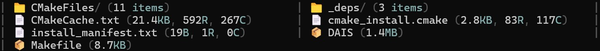

# &lt; DATA / AI SHELL >
## ... [-] DAIS

- In researching / early development stage
- Currently meets the MVP requirements stated in roadmap.md

## What
- DAIS is a PTY (pseudoterminal) shell wrapper. 
- Core is written in C++, that supports Python scripts as extensions.

### Visual Customization
DAIS allows you to style your file listing exactly how you want it; from minimal layouts to rich, colorful themes or even icon-enhanced displays. Here are some pre-configured examples:

**Neon Style** (High Contrast & Vibrant)

**Amber Retro** (Classic Terminal Feel)

**Deep Sea** (Professional Dark Theme)

**Icon Enhanced** (Informative / Visual)

**Basic / Minimalist** (Clean & Simple)

## Under the Hood: Features
Beyond the visuals, DAIS is built for performance and extensibility.

- **Zero-Latency PTY**: Seamless shell wrapping with native C++ performance.
- **Python Plugin System**: Extend functionality using standard Python scripts
- **Smart `ls` Command**:
    - **Adaptive Performance**: Uses parallel processing for near instant analysis of large directories
    - **Data-Aware**: Automatically detects CSV/TSV/JSON files and displays column counts
    - **Text Insights**: Shows line counts and max line width for code/text files
    - **Configurable Sorting**: Sort output by name, size, type, or row count (`:ls size desc`)
    - **Fully Configurable**: Define your own output templates, icons, and colors, from config.py
- **Compatibility**:
    - **Configurable Prompt Detection**: Automatically handles complex prompts (multi-line, colored, autosuggestions), supporting most standard prompts out-of-box, adjustable for anything else via config
    - **Shell Support**: Tested on **Bash**, **Zsh**, and **Fish**
    - **Shell-Ready**: Handles special filenames (spaces, quotes, emojis) correctly
- **Smart Interception**: DAIS commands only work at the shell prompt: vim, nano, and other apps run unaffected

### Runtime Commands

#### File Listing Configuration (`:ls`)
Configure how the `ls` command displays files. Arguments can be provided in any order, separated by spaces or commas.

**Parameters:**
- **Sort Field**: `name`, `size`, `type`, `rows`, `none`
- **Order**: `asc`, `desc`
- **Group Directories**: `true` (dirs first), `false` (mixed)
- **Reset**: `d` or `default` (reset to config defaults)

**Examples:**
| Command | Effect |
|---------|--------|
| `:ls` | Show current settings |
| `:ls size desc` | Sort by size, descending |
| `:ls type, asc` | Sort by type, ascending (comma separated) |
| `:ls false` | Disable "directories first" grouping |
| `:ls d` | Reset to defaults |

#### History & System
| Command | Description |
|---------|-------------|
| `:history` | Show last 20 commands |
| `:history n` | Show last n commands |
| `:history clear` | Clear command history |
| `:q` or `:exit` | Exit DAIS |

### Command History
DAIS maintains its own file-based history (~/.dais_history) separate from your shell's history.
- **Smart Navigation**: Use UP/DOWN arrows at an empty prompt to navigate DAIS history.
- **Original Commands**: Saves exactly what you typed (e.g., `ls`, including the projects own runtime : commands).
- **Context Aware**: Arrow keys only navigate history when the shell is idle; they work normally inside apps like vim or nano.

## Scope
- Projects scope is to create a helpful open-source extension for Data / AI Engineers or like minded people in their day-to-day tasks, running in their favorite shell.
- This project will use present technologies and as an open-source, allows others to contribute their ideas and features to it as well.
- Allows Python scripts so other Data / AI oriented people can create plugins in the language they are most confident in.

## Why
Why not, terminals should be smarter

## Build
### 1. Install dependencies
#### Ubuntu 24.04 LTS
- `sudo apt update`
- `sudo apt install build-essential cmake python3-dev g++-13`
#### macOS
- `xcode-select --install`
- `brew install cmake python`

### 2. Clone the repo and cd in to it
- `git clone https://github.com/mitro54/DAIS.git`
- `cd DAIS`

### 3. Create a build folder and cd in to it
- `mkdir build`
- `cd build`

### 4. Run cmake and make
- `cmake ..` or `cmake -DCMAKE_CXX_COMPILER=g++-13 ..` to make sure it uses at least GCC 13 for C++20 (Linux)
- `make`

### 4.1 (Optional) Install the DAIS command system-wide
`sudo make install`, this allows you to run this project with `DAIS` from anywhere in terminal!

### 5. Run it (if you did not do 4.1)
`./DAIS`