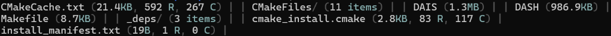
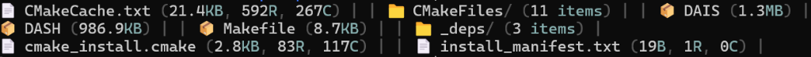

# &lt; DATA / AI SHELL >
## ... [-] DAIS

- In researching / early development stage
- Currently meets the MVP requirements stated in roadmap.md

## What
- DAIS is a PTY (pseudoterminal) shell wrapper. 
- Core is written in C++, that supports Python scripts as extensions.

## Current Features
- **Zero-Latency PTY**: Seamless shell wrapping with native C++ performance.
- **Python Plugin System**: Extend functionality using standard Python scripts
- **Smart `ls` Command**:
    - **Data-Aware**: Automatically detects CSV/TSV/JSON files and displays column counts
    - **Text Insights**: Shows line counts and max line width for code/text files
    - **Configurable Sorting**: Sort output by name, size, type, or row count (`:ls size desc`)
    - **Fully Configurable**: Define your own output templates, icons, and colors
    - **Custom File Types**: Configure which extensions count as "text" or "data"
- **Smart Interception**: DAIS commands only work at the shell prompt—vim, nano, and other apps run unaffected

### Runtime Commands
| Command | Description |
|---------|-------------|
| `:ls` | Show current sort settings |
| `:ls size desc false` | Sort by size, descending, dirs mixed with files |
| `:ls d` | Reset sort to defaults |
| `:q` or `:exit` | Exit DAIS |

### Visual Customization
DAIS allows you to style your file listing exactly how you want it; from minimal layouts to rich, icon-enhanced displays.

**Default look:**

**One possible custom look:**

## Scope
- Projects scope is to create a helpful open-source extension for Data / AI Engineers or like minded people in their day-to-day tasks, running in their favorite shell.
- This project will use present technologies and as an open-source, allows others to contribute their ideas and features to it as well.
- Allows Python scripts so other Data / AI oriented people can create plugins in the language they are most confident in.

## Why
Why not, terminals should be smarter

## Build
### 1. Install dependencies
#### Ubuntu 24.04 LTS
- `sudo apt update`
- `sudo apt install build-essential cmake python3-dev g++-13`
#### macOS
- `xcode-select --install`
- `brew install cmake python`

### 2. Clone the repo and cd in to it
- `git clone https://github.com/mitro54/DAIS.git`
- `cd DAIS`

### 3. Create a build folder and cd in to it
- `mkdir build`
- `cd build`

### 4. Run cmake and make
- `cmake ..` or `cmake -DCMAKE_CXX_COMPILER=g++-13 ..` to make sure it uses at least GCC 13 for C++20 (Linux)
- `make`

### 4.1 (Optional) Install the DAIS command system-wide
`sudo make install`, this allows you to run this project with `DAIS` from anywhere in terminal!

### 5. Run it (if you did not do 4.1)
`./DAIS`